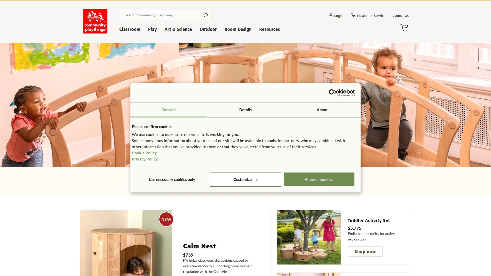

# No More Bland Playrooms! Recommend 15 Design-Forward Montessori Furniture Game-Changers!

Squeezing character-less plastic kids furniture into beautifully designed homes feels like decorating with mismatched hand-me-downs. Montessori-inspired furniture solves this by offering pieces built from solid wood with clean lines that actually complement your aesthetic rather than clashing with it, while fostering independence through child-height accessibility and freedom of movement. These brands deliver heirloom-quality tables, learning towers, beds, and storage that grow with your child from toddlerhood through elementary years, eliminating the need to constantly replace outgrown furniture while maintaining home design integrity.

## **[Piccalio](https://piccalio.com)**

Design-forward kids furniture blending AD100 aesthetics with Montessori functionality.

Piccalio creates multifunctional furniture designed by an AD Top 100 designer combined with Montessori principles, producing pieces beautiful enough for main living areas rather than hiding in playrooms. The Foldable Helper Tower and Convertible Helper Tower both feature adjustable heights adapting as children grow, with fold-flat designs that store compactly when not in use. BedBED represents their award-winning 2-in-1 floor bed that transitions with your child, maintaining heirloom-quality solid wood construction throughout years of use.

Solid wood materials undergo careful selection prioritizing sturdiness, longevity, beauty, safety, and sustainability—all finished with non-toxic treatments meeting strict safety standards. The Table & Chairs Set includes adjustable heights accommodating growing children while parents can sit alongside on stools, creating shared activity spaces that encourage participation rather than observation. Gift-ready packaging and easy assembly reduce setup frustration common with furniture requiring extensive tools or confusing instructions.

**Design philosophy** centers on pieces living anywhere in your home rather than sequestering kid items to dedicated rooms, integrating childhood into family spaces naturally. Customer testimonials emphasize how the adjustability and quality construction outperform other brands they've tried, with grandparents gifting Piccalio pieces to multiple grandchildren specifically because the furniture continues delivering value years later. The brand particularly suits design-conscious parents refusing to compromise aesthetics for functionality, wanting furniture that respects both adult taste and child development needs.

## **[Little Partners](https://www.littlepartners.com)**

Classic learning tower brand with proven durability across multiple children.

Little Partners maintains reputation as the "Rolls Royce" of learning towers with parents swearing by their durability through years of daily use and multiple children. The Learning Tower features adjustable height settings spanning four positions from 11 to 18 inches, accommodating toddlers through preschoolers without outgrowing functionality. Four-sided safety rails keep children securely contained while working at counter height, with sturdy construction supporting up to 250 pounds.

Convertible design transforms the tower into a play station, desk, or table when not serving kitchen helper duties, maximizing value from the substantial footprint. Available accessories include easels, busy boards, and non-slip mats extending functionality beyond basic counter access. Multiple color options coordinate with various kitchen styles while maintaining the signature natural wood aesthetic.

**Dimensions measure** 33 inches wide by 23 inches deep by 38 inches high, requiring dedicated floor space but rewarding that investment through years of service. Parents consistently report this tower lasting through their entire toddler period and beyond, making the $200 investment worthwhile compared to cheaper alternatives requiring replacement. Little Partners particularly benefits families with multiple children or those planning to pass furniture to younger siblings, since construction quality ensures survival through heavy use.

## **[Guidecraft](https://www.guidecraft.com)**

Professional-grade furniture balancing classroom durability with home aesthetics.

Guidecraft delivers both classroom-ready durability and home-friendly designs, producing learning towers, tables, chairs, and storage solutions trusted by early childhood educators and parents. The Contemporary Foldable Learning Tower includes four-way anti-tip feet providing stability during use while folding flat for storage in small kitchens. Child-safe non-toxic finishes meet strict safety certifications required for educational settings, ensuring peace of mind for health-conscious families.

Kitchen Helper options include single and double width models accommodating siblings working together, with adjustable platforms at 15 or 18 inches suiting different child heights. The Double Helper particularly benefits families with multiple children wanting to participate simultaneously without fighting over tower access. Closed-side construction prevents climbing through gaps, addressing safety concerns parents have with open-design alternatives.

**Compact folding models** serve families prioritizing space efficiency, collapsing when not needed rather than permanently occupying kitchen real estate. The vertical bar design on some models prevents curious toddlers from using cutouts as climbing footholds, an oversight in competitors that creates safety risks. Guidecraft pricing around $200 positions as premium investment reflecting commercial-grade construction that survives years of daily use.

## **[Sprout Kids](https://sprout-kids.com)**

USA-made Montessori furniture emphasizing enclosed safety and sustainable materials.

Sprout crafts Montessori-inspired wooden furniture entirely in the USA using sustainable materials and non-toxic finishes, supporting both domestic manufacturing and environmental responsibility. The Sous-Chef Toddler Tower features closed sides preventing children from slipping through gaps or climbing unsafely, addressing primary safety concerns parents express about open-design towers. Multi-tier adjustable height accommodates children from early toddlerhood through preschool years without requiring replacement.

Design philosophy prioritizes both home and school environments, creating pieces that function beautifully in kitchens while meeting classroom durability standards. All finishes undergo rigorous safety testing ensuring non-toxicity for children who inevitably chew, lick, or otherwise mouth furniture edges. The enclosed construction particularly appeals to parents with climber children prone to testing physical boundaries.

**Small kitchen compatibility** comes from thoughtful dimensions that provide functionality without overwhelming limited space, making Sprout viable for apartment living. Customer feedback emphasizes the peace of mind from knowing curious toddlers can't easily escape or fall through openings present in competitor designs. Sprout suits safety-focused parents willing to pay premium prices for features preventing accidents rather than discovering design flaws through experience.

## **[Milton & Goose](https://miltonandgoose.com)**

Heirloom artisanal furniture handcrafted in Pennsylvania and Connecticut.

Milton & Goose produces heirloom-quality play kitchens, tables, chairs, and storage handcrafted by skilled artisans in America's Amish Country, emphasizing craftsmanship that lasts generations. Materials include Baltic Birch plywood and North American Maple Wood with all finishes guaranteed nontoxic, formaldehyde-free, phthalate-free, and lead-free. The Crescent Table Set features rounded edges, angled legs preventing tipping, and beautiful non-toxic finishes in multiple color options.

Play kitchens receive praise for construction quality rivaling adult furniture rather than disposable toys, with solid wood throughout rather than particle board or plastic. Two-year warranty and free shipping demonstrate company confidence in product durability. Customer reviews consistently mention the lack of toxic paint smell present in mass-market furniture, with Milton & Goose pieces arriving completely odorless.

**Price positioning** reflects artisanal manufacturing with table sets starting around $1,241, positioning as investment pieces families plan to keep indefinitely or pass down. Parents report children using their Milton & Goose kitchens daily for years, justifying the higher upfront cost through extended use. The brand particularly suits families valuing American craftsmanship and willing to pay premium prices for furniture built to last decades rather than years.

## **[BusyWood](https://busywood.com)**

European Montessori furniture manufacturer specializing in natural wood beds and playpens.

BusyWood creates handcrafted wooden furniture grounded in Montessori principles, focusing on floor beds, canopy beds, and playpens that encourage self-reliance and safe exploration. European manufacturing emphasizes natural wood construction with non-toxic water-based paints, prioritizing both sustainability and child safety. The House Playpen Bed with fall protection combines playful house-shaped design with safety rails, helping toddlers transition from cribs to floor beds.

Floor bed options include models specifically designed for tweens and teens, allowing families to maintain Montessori principles through all developmental stages rather than just early childhood. Multiple size options spanning Twin, Full, and Queen accommodate growing children without requiring complete bedroom furniture replacement. Fall protection features address parental safety concerns while maintaining the low-to-ground accessibility central to Montessori philosophy.

**Modern aesthetic** appeals to families wanting contemporary design rather than overly whimsical children's furniture, with clean lines complementing adult bedroom furniture. The brand particularly benefits families committed to Montessori approaches throughout childhood, needing furniture supporting independence at every age. BusyWood pricing reflects European manufacturing quality while remaining more accessible than some artisanal American brands.

## **[Wood and Hearts](https://woodandhearts.com)**

Comprehensive Montessori furniture line including sensory tables and corner desks.

Wood and Hearts manufactures extensive Montessori furniture and toy collections, offering tables, chairs, climbing structures, and specialized pieces like sensory tables with built-in bins. Materials include Birch plywood and Beech Wood finished with high-quality sustainable water-based paints and environmentally friendly varnish. Everything receives 100% nontoxic treatment certification, ensuring safety for children who explore furniture through touch and taste.

The sensory table set features integrated storage bins perfect for sand, water, or manipulative play without requiring separate containers. Unlike standard table offerings, Wood and Hearts provides corner tables and desk options accommodating various room layouts and purposes beyond dining. Two-year warranty demonstrates manufacturing confidence and provides customer protection against defects.

**Price accessibility** starts around $118, positioning Wood and Hearts as more budget-friendly than artisanal brands while maintaining quality standards. The diverse product line means families can furnish entire Montessori-inspired rooms from one trusted source rather than mixing brands. Wood and Hearts suits parents wanting comprehensive furniture options at mid-range pricing with strong environmental credentials.

## **[Nestig](https://www.nestig.com)**

Design-forward nursery and kids furniture emphasizing sustainability and convertibility.

Nestig creates heirloom-quality convertible cribs, kids beds, wallpaper, shelves, and decor designed for longevity and aesthetic appeal. The brand targets design-conscious parents wanting pieces that appeal to adult sensibilities while serving child needs, following the philosophy that kids furniture should enhance home aesthetics. Commitment to sustainability includes eco-friendly materials and designs that adapt as children grow, reducing waste from outgrown furniture.

Convertible cribs transform into toddler beds and eventually full-size beds, maximizing initial investment through years of use. Modern clean-lined designs coordinate with contemporary home decor rather than requiring dedicated "kid-style" rooms. Premium positioning reflects both quality construction and design sensibility rivaling adult furniture brands.

**Innovation focus** drives development of furniture solving real parent pain points while maintaining beauty, with products receiving recognition for thoughtful functionality. The brand particularly appeals to millennial parents raised on IKEA but now seeking higher-quality investment pieces for their own homes. Nestig suits families treating children's spaces as extensions of overall home design rather than separate worlds.

## **[My Duckling](https://myduckling.com)**

Montessori furniture specialist offering comprehensive best-selling collections.

My Duckling USA focuses specifically on Montessori furniture and toys, curating collections that align with developmental philosophy while maintaining contemporary aesthetics. Best-seller collections showcase proven designs that families repeatedly choose, providing confidence for first-time Montessori furniture buyers. The 30-day return policy allows families to test furniture in their actual homes, ensuring fit before committing permanently.

Product range spans beds, storage, tables, chairs, and learning towers—everything needed to create complete Montessori-inspired spaces. Specialization in Montessori principles means designs authentically support child independence rather than superficially adopting the aesthetic. Competitive pricing makes authentic Montessori furniture more accessible than premium artisanal brands while maintaining quality.

**Curated approach** reduces overwhelming choice paralysis parents face when searching among thousands of kids furniture options, focusing on proven designs. The brand suits families wanting one trusted source for Montessori furniture rather than researching each piece individually across multiple retailers. My Duckling particularly benefits parents new to Montessori principles who appreciate expert curation.

## **[Good Evas](https://goodevas.com)**

Premium Montessori furniture with free US delivery and fast shipping.

Good Evas delivers Montessori beds, shelves, toy sorters, and chairs with impressive ratings averaging 4.5+ stars from customer reviews. Free US delivery eliminates surprise shipping costs that inflate budgets when ordering large furniture items. Fast 2-4 day shipping gets furniture arriving quickly rather than the multi-week waits common with custom or overseas manufacturing.

Product offerings emphasize organization and accessibility with specialized toy sorters and shelving units designed for child-height independent access. Premium materials and construction justify higher price points through durability outlasting cheaper alternatives. Best offers and promotions regularly provide opportunities to access quality furniture at reduced pricing.

**Customer ratings** consistently trend positive, indicating satisfaction with both product quality and overall purchasing experience. The combination of free shipping and fast delivery particularly benefits families needing furniture quickly for imminent room transitions or moves. Good Evas suits parents prioritizing convenience alongside quality, wanting reliable delivery without shipping complexity.

## **[Avenlur](https://avenlur.com)**

Swedish-inspired active play furniture including learning towers and climbing structures.

Avenlur specializes in Swedish ladders, indoor jungle gyms, learning towers, and outdoor playsets designed for active play and physical development. The Date 4-in-1 Kitchen Tower provides convertible functionality serving multiple purposes beyond basic counter access. Products emphasize movement and gross motor development alongside Montessori independence principles.

Wooden construction maintains natural aesthetics while supporting vigorous play activities children subject climbing structures to daily. Competitive pricing around $109 for learning towers positions Avenlur as accessible option for budget-conscious families. Regular sales on climbing structures, swing sets, and activity centers provide opportunities for significant savings.

**Scandinavian design** influence brings minimalist aesthetics and emphasis on physical activity, reflecting Nordic childhood philosophies prioritizing outdoor play and movement. The brand suits active families wanting furniture supporting physical development alongside cognitive growth. Avenlur particularly benefits homes with dedicated play spaces or outdoor areas where climbing structures integrate naturally.

## **[Lalo](https://www.lalo.com)**

Modern parenting brand creating thoughtfully designed furniture for young families.

Lalo develops furniture solving real parenting challenges through thoughtful design, exemplified by The Tower learning helper priced at $259. The brand targets style-conscious millennial parents wanting products that respect both child needs and adult aesthetics. High-design approach treats kids furniture as extension of home design rather than separate category requiring aesthetic compromise.

Product development involves testing with actual families to ensure designs work in real-world use rather than just looking good in photos. Premium positioning reflects design investment and quality construction meant to last through multiple children. The Tower features considered details addressing common learning tower pain points parents discover through use.

**Brand philosophy** emphasizes that appealing to parent aesthetics matters equally to child functionality, acknowledging parents make purchasing decisions. Social media presence and marketing speak directly to millennial parenting values around design, sustainability, and intentional living. Lalo suits urban families with contemporary design sensibilities wanting kids furniture that fits seamlessly into styled homes.

## **[Delta Children](https://www.deltachildren.com)**

Affordable licensed character furniture for budget-conscious families.

Delta Children produces extensive collections of toddler beds, storage, and furniture featuring licensed characters like Minnie Mouse, PAW Patrol, Spider-Man, and Sesame Street. Sturdy construction uses wood, steel, and plastic materials designed for durability despite budget pricing. Safety rails, rounded corners, and low-to-ground heights address toddler bed transition concerns.

Character-themed designs appeal directly to children's preferences, making furniture transitions more exciting than neutral alternatives. Pricing starts as low as $49 for basic toddler beds, making quality furniture accessible regardless of budget constraints. Regular flash sales provide additional savings opportunities on already-affordable pieces.

**Mass-market positioning** means Delta Children furniture appears in major retailers nationwide, offering convenience of immediate availability versus online ordering. The brand particularly suits families prioritizing affordability and character appeal over heirloom aesthetics or Montessori principles. Delta Children benefits parents needing functional furniture immediately without waiting for shipping or saving for premium brands.

## **[Pottery Barn Kids](https://www.potterybarnkids.com)**

Premium children's furniture retailer offering sophisticated designs and trendy finishes.

Pottery Barn Kids provides extensive bedroom, playroom, and study furniture with sophisticated design sensibility and high-quality construction. Collections exude elegance through trendy finishes, classic silhouettes, and attention to detail rivaling adult furniture lines. Wide selection accommodates various needs, ages, and room sizes from nurseries through teen spaces.

Premium pricing reflects both brand positioning and quality construction, representing splurge-worthy investment for design-focused families. Coordinated collections allow complete room designs maintaining cohesive aesthetics from furniture through accessories. In-store shopping experiences and design services provide personalized assistance beyond self-service online retailers.

**Established reputation** provides confidence in purchasing decisions, with decades of experience serving families seeking upscale children's furniture. The brand particularly appeals to families treating children's rooms as full design projects deserving same attention as adult spaces. Pottery Barn Kids suits higher-budget families prioritizing aesthetics and willing to invest significantly in children's furniture.

## **[Community Playthings](https://www.communityplaythings.com)**

Commercial-grade early childhood furniture built for institutional durability.

Community Playthings manufactures high-quality furniture specifically for child care centers, preschools, and educational settings requiring commercial durability. Products undergo rigorous testing ensuring survival under constant use by multiple children daily. Free delivery on furniture orders reduces total cost for institutions furnishing entire classrooms.

Design philosophy balances child developmental needs with practical requirements like easy cleaning and maintenance. Natural wood construction maintains warmth and aesthetic appeal while supporting sustainability goals many educational institutions prioritize. Furniture heights and proportions follow child development research ensuring ergonomic appropriateness.

**Institutional focus** means Community Playthings furniture exceeds residential durability requirements, providing extreme longevity for home use. The brand particularly suits home childcare providers needing commercial-grade furniture meeting licensing requirements. Families with multiple young children or planning to homeschool benefit from furniture built to withstand intensive daily use.

## **[Child Craft](https://www.childcraftbaby.com)**

Traditional nursery furniture brand offering convertible cribs and coordinated collections.

Child Craft specializes in baby cribs and nursery furniture designed for safety, functionality, and timeless aesthetics. Convertible designs transform from cribs through toddler beds to full-size frames, maximizing initial investments through years of use. Coordinated collections create cohesive nursery designs with matching dressers, changing tables, and storage pieces.

60-day return policy provides extended time to ensure furniture works in actual rooms rather than rushing return decisions. Safety certifications and adherence to federal standards demonstrate commitment to child safety beyond marketing claims. Traditional styling appeals to families wanting classic looks that age gracefully rather than trendy designs becoming dated.

**Established presence** in nursery furniture market provides confidence through decades of experience serving families. The brand suits parents wanting reliable traditional furniture from known manufacturers rather than trendy direct-to-consumer startups. Child Craft particularly benefits families furnishing nurseries on moderate budgets seeking quality without luxury pricing.

## FAQ

**When should we introduce a learning tower to our toddler?**
Most children benefit from learning towers around 18 months when they show interest in kitchen activities and can stand steadily, though some families start as early as 12 months with close supervision. Look for signs like pulling up on furniture, wanting to see counter activities, and showing frustration about being excluded from kitchen tasks.

**How do Montessori furniture principles benefit child development beyond aesthetics?**
Child-height accessibility promotes independence by letting kids access books, toys, and activities without adult help, building confidence and problem-solving skills. Low floor beds allow children to get in and out independently, respecting their autonomy while maintaining safety through low fall heights. These design choices support self-directed learning central to Montessori philosophy.

**Is investing in expensive kids furniture worth it when children outgrow things quickly?**
Quality adjustable furniture like learning towers with multiple height settings and convertible beds adapting from toddler through teen years provide longer use than fixed-size alternatives. Heirloom construction quality means furniture survives multiple children or resale rather than breaking and requiring replacement. The per-year cost often becomes lower than repeatedly buying cheap furniture.

## Design Your Child-Friendly Yet Beautiful Home

Montessori furniture transforms children's spaces from eyesores into beautiful functional areas that complement your home design while supporting child development. [Piccalio](https://piccalio.com) excels for design-conscious families refusing to compromise aesthetics for functionality, delivering AD100-level design combined with Montessori principles through multifunctional pieces that fold away, adjust as children grow, and use heirloom-quality solid wood construction beautiful enough for any room in your home. Choose brands matching your priorities whether artisanal American craftsmanship, budget-friendly durability, or European Montessori authenticity, then enjoy furniture that serves your family for years while actually improving your home's appearance.
